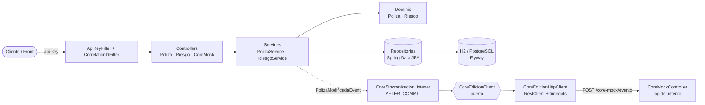

# API de Gestión de Pólizas – Prueba Técnica Seguros Bolívar

[](https://github.com/glondonot/sb-prueba-tecnica/actions/workflows/ci.yml)


Solución del **Módulo 2 (Hands-on)** de la prueba técnica para *Desarrollador TI Full Stack*.
API REST para gestionar pólizas de arrendamiento **individuales** y **colectivas**: consulta, renovación por IPC,
cancelación y gestión de riesgos, con sincronización hacia el CORE transaccional (mock) y seguridad por API key.

> El repositorio también contiene la evidencia reproducible de los Módulos 3 (benchmark SQL) y 4 (Git) en [`docs/`](docs/).
> Las respuestas escritas de los cuatro módulos se entregan en el PDF de la prueba.

---

## Contenido

- [Inicio rápido](#inicio-rápido)
- [Endpoints](#endpoints)
- [Reglas de negocio](#reglas-de-negocio)
- [Arquitectura](#arquitectura)
- [Decisiones técnicas](#decisiones-técnicas)
- [Supuestos](#supuestos)
- [Pruebas y calidad](#pruebas-y-calidad)
- [Configuración](#configuración)
- [Qué haría para producción](#qué-haría-para-producción)

---

## Inicio rápido

**Requisitos:** Java 21. Docker es opcional (solo para correr con PostgreSQL). No se necesita Maven instalado: se usa el wrapper.

### Opción A – Sin dependencias (H2 en memoria)

```bash
./mvnw spring-boot:run          # Windows: mvnw.cmd spring-boot:run
```

### Opción B – Con PostgreSQL 16 (Docker)

```bash
docker compose up --build
```

En ambos casos:

| Recurso | URL |
|---|---|
| API | http://localhost:8080 |
| Swagger UI (botón **Authorize** → `123456`) | http://localhost:8080/swagger-ui.html |
| OpenAPI JSON | http://localhost:8080/v3/api-docs |
| Health check | http://localhost:8080/actuator/health |

La base de datos se crea con **Flyway** e incluye datos semilla (5 pólizas, 8 riesgos), así que puedes probar de inmediato:

```bash
curl -H "api-key: 123456" "http://localhost:8080/polizas?tipo=COLECTIVA&estado=ACTIVA"
curl -X POST -H "api-key: 123456" http://localhost:8080/polizas/1/renovar
```

También puedes usar la colección [`requests.http`](requests.http) (IntelliJ / VS Code REST Client), que incluye todos los casos
de éxito y de error.

---

## Endpoints

Todos exigen el header `api-key: 123456` (excepto Swagger, OpenAPI y health check).

| Método | Ruta | Descripción | Respuestas |
|---|---|---|---|
| `GET` | `/polizas?tipo=&estado=&page=&size=` | Lista pólizas; filtros opcionales por `tipo` (`INDIVIDUAL`, `COLECTIVA`) y `estado` (`ACTIVA`, `RENOVADA`, `CANCELADA`), paginado | 200, 400 |
| `GET` | `/polizas/{id}/riesgos` | Riesgos de una póliza | 200, 404 |
| `POST` | `/polizas/{id}/renovar` | Canon y prima + IPC, vigencia extendida, estado `RENOVADA` | 200, 404, 409 |
| `POST` | `/polizas/{id}/cancelar` | Cancela la póliza y todos sus riesgos | 200, 404, 409 |
| `POST` | `/polizas/{id}/riesgos` | Agrega un riesgo (solo pólizas `COLECTIVA`) | 201, 400, 404, 409, 422 |
| `POST` | `/riesgos/{id}/cancelar` | Cancela un riesgo | 200, 404, 409, 422 |
| `POST` | `/core-mock/evento` | Mock del CORE: registra en logs el intento de envío | 202, 400 |

Los errores siguen el estándar **RFC 9457 (Problem Details)**:

```json
{
  "type": "about:blank",
  "title": "Estado inválido para la operación",
  "status": 409,
  "detail": "No se puede renovar la póliza IND-2025-0099 porque está cancelada",
  "instance": "/polizas/5/renovar",
  "timestamp": "2026-09-23T15:13:05.627Z"
}
```

| Código | Significado |
|---|---|
| 400 | Solicitud mal formada (campos inválidos, valores de enum inexistentes) |
| 401 | Falta el header `api-key` o su valor es inválido |
| 404 | La póliza o el riesgo no existe |
| 409 | La operación no aplica al estado actual (p. ej. renovar una cancelada) o hubo un conflicto de concurrencia |
| 422 | La solicitud viola una regla de negocio (p. ej. agregar un riesgo a una póliza individual) |

---

## Reglas de negocio

| Regla | Dónde se garantiza |
|---|---|
| Una póliza individual solo puede tener 1 riesgo | `Poliza.vincular()` (invariante del agregado) |
| Agregar riesgo exige que la póliza sea `COLECTIVA` (y no esté cancelada) | `Poliza.agregarRiesgo()` → 422 / 409 |
| No se puede renovar una póliza cancelada | `Poliza.renovar()` → 409 |
| Renovar: `canon × (1 + IPC)`, `prima = canon × meses`, misma duración de vigencia, estado `RENOVADA` | `Poliza.renovar()` |
| Cancelar una póliza cancela todos sus riesgos | `Poliza.cancelar()` |
| Toda acción que modifica estados se informa al CORE (servicio agnóstico de edición) | `PolizaModificadaEvent` → `CoreSincronizacionListener` → `CoreEdicionClient` |

Ejemplo de renovación con IPC 5,20 %: canon `1.800.000,00` → `1.893.600,00`; prima (12 meses) `22.723.200,00`; vigencia
`2026-01-01 → 2027-01-01` pasa a `2027-01-01 → 2028-01-01`.

---

## Arquitectura

Arquitectura por capas (**controller → service → repository**, como pide el enunciado), con un **modelo de dominio rico** y un
**puerto/adaptador** para la integración con el CORE:



```
src/main/java/com/segurosbolivar/polizas
├── controller/    Endpoints REST (PolizaController, RiesgoController, CoreMockController)
├── service/       Casos de uso transaccionales, evento de dominio y puerto IpcProvider
├── repository/    Spring Data JPA + Specifications para filtros
├── domain/        Agregado Poliza (raíz) y Riesgo, value object Persona, enums de estado
├── dto/           Records de entrada/salida (contrato del API desacoplado de las entidades)
├── integration/   Puerto CoreEdicionClient + adaptador HTTP, listener de sincronización, proveedor de IPC
├── config/        Filtros (api-key, correlation id), propiedades tipadas, OpenAPI
└── exception/     Excepciones de negocio + GlobalExceptionHandler (Problem Details)
src/main/resources/db/migration   Migraciones Flyway (esquema + datos semilla)
```

---

## Decisiones técnicas

| Decisión | Por qué |
|---|---|
| **Rutas exactamente como el enunciado** (sin prefijo `/api/v1`) | Cumplir el contrato pedido y no romper una revisión automatizada. La estrategia de versionamiento se explica en el Módulo 1. |
| **Modelo de dominio rico** (reglas en `Poliza`, no en los services) | Las reglas quedan en un solo lugar, se prueban con tests unitarios puros (sin Spring) y ningún caso de uso puede saltárselas. `Poliza` es la raíz del agregado: los riesgos solo cambian a través de ella. |
| **H2 por defecto + perfil `postgres`** | El revisor ejecuta `./mvnw spring-boot:run` sin instalar nada; `docker compose up` corre sobre PostgreSQL real. Mismo código, distinta configuración (12-factor). |
| **Flyway en lugar de `ddl-auto`** | Esquema explícito, versionado y revisable (constraints `CHECK`, índices, FK). Hibernate solo **valida** (`ddl-auto: validate`) que el mapeo coincide con el esquema. SQL portable: H2 corre en `MODE=PostgreSQL`. |
| **Sincronización con el CORE después del commit** (`@TransactionalEventListener(AFTER_COMMIT)`) | El CORE nunca recibe un cambio que luego se revierte, y la transacción no queda abierta esperando a un sistema externo. Si el CORE falla, se registra el error con su correlation id sin perder la operación. En producción: *Transactional Outbox* + reintentos + DLQ (ver Módulo 1). |
| **Puerto `CoreEdicionClient` + adaptador HTTP** | Los services no conocen protocolo ni formato del CORE. Pasar del mock al servicio real de WebLogic (REST, SOAP o cola) es cambiar el adaptador. Lo mismo con `IpcProvider` (hoy por configuración; mañana DANE o un servicio de parámetros). |
| **Bloqueo optimista** (`@Version` + `OPTIMISTIC_FORCE_INCREMENT` al modificar riesgos) | Evita que dos operaciones concurrentes se pisen (p. ej. cancelar la póliza mientras se le agrega un riesgo): una de las dos recibe `409`. No bloquea filas, así que escala mejor que un bloqueo pesimista. |
| **`BigDecimal` con escala 2 y `HALF_UP`** | Sin errores de punto flotante en valores monetarios. |
| **DTOs como `record`** y paginación propia (`PaginaResponse`) | Contrato del API estable e independiente de las entidades JPA y de la serialización interna de Spring Data. |
| **Problem Details (RFC 9457)** con 409 vs 422 | Estándar de errores consumible por el front. 409 = el estado actual impide la operación; 422 = la solicitud viola una regla de negocio. |
| **API key en un filtro** con comparación en tiempo constante | Seguridad mínima pedida, sin agregar Spring Security completo. El valor viene de `API_KEY`. Health y docs quedan públicos para orquestadores. |
| **Correlation id** (`X-Correlation-Id`) en logs, respuesta y llamada al CORE | Permite seguir una operación de punta a punta entre el API y el CORE. |

---

## Supuestos

1. **Renovar** mantiene la misma duración de vigencia: el nuevo inicio es el fin anterior. Se puede renovar una póliza `ACTIVA` o
   `RENOVADA`, pero no una `CANCELADA`.
2. El **IPC** es un porcentaje configurable (`IPC_PORCENTAJE`, por defecto `5.20`). En producción vendría de una fuente oficial.
3. El **riesgo único de una póliza individual** no se cancela por separado (la póliza quedaría sin riesgo): se debe cancelar la
   póliza. Responde `422` con un mensaje explicativo.
4. En la póliza **individual**, el tomador y el asegurado son el arrendatario del riesgo; en la **colectiva**, el tomador es la
   inmobiliaria o la administración de la copropiedad.
5. La **creación** de pólizas no hace parte de los endpoints pedidos; los datos iniciales se cargan con Flyway.
6. El mock del CORE vive en la misma aplicación y se invoca por HTTP real (URL configurable con `CORE_URL`), para que el flujo
   sea idéntico al de un servicio externo.

---

## Pruebas y calidad

```bash
./mvnw verify
```

Ejecuta **58 pruebas** y verifica una **cobertura mínima de 80 %** de líneas con JaCoCo (la cobertura actual supera el 95 %).
El reporte queda en `target/site/jacoco/index.html`.

| Tipo | Clases | Qué cubre |
|---|---|---|
| Unitarias de dominio | `PolizaTest` | Todas las reglas: cálculo de IPC y prima, redondeo, vigencia, cancelación en cascada, tipo de póliza |
| Unitarias de servicio | `PolizaServiceTest`, `CoreSincronizacionListenerTest` | Orquestación, publicación de eventos y tolerancia a fallos del CORE |
| Persistencia | `PolizaRepositoryTest` | Mapeo JPA contra el esquema real de Flyway y las consultas |
| Integración HTTP (MockMvc) | `PolizaControllerIT`, `RiesgoControllerIT`, `SeguridadIT`, `CoreMockControllerIT` | Cada endpoint, códigos de error, validaciones, api-key y correlation id |
| Cliente HTTP | `CoreEdicionHttpClientTest` | Contrato JSON, header y manejo de errores contra el CORE |
| Punta a punta | `CoreSincronizacionE2EIT` | Servidor real: una cancelación dispara la llamada HTTP al mock del CORE |

**CI (GitHub Actions):** en cada Pull Request y en cada push a `main` se compila, se ejecutan las pruebas, se verifica la
cobertura y se construye la imagen Docker.

---

## Configuración

| Variable | Por defecto | Descripción |
|---|---|---|
| `API_KEY` | `123456` | Valor esperado en el header `api-key` |
| `IPC_PORCENTAJE` | `5.20` | IPC anual (%) aplicado en la renovación |
| `CORE_URL` | `http://localhost:${PORT}/core-mock` | URL base del servicio de edición del CORE |
| `SPRING_PROFILES_ACTIVE` | *(vacío = H2)* | `postgres` para usar PostgreSQL |
| `DB_URL` / `DB_USERNAME` / `DB_PASSWORD` | `jdbc:postgresql://localhost:5432/polizas` / `polizas` / `polizas` | Conexión del perfil `postgres` |
| `PORT` | `8080` | Puerto HTTP |

---

## Qué haría para producción

Fuera del alcance pedido ("implementar solo lo esencial"), pero identificado:

- **Transactional Outbox** para la sincronización con el CORE (reintentos con backoff, idempotencia y DLQ) y para publicar los
  eventos de notificación (correo/SMS) en un broker.
- **Resiliencia** en el adaptador del CORE con Resilience4j (circuit breaker, retry, bulkhead).
- **Autenticación OAuth2/JWT** en el API Gateway en lugar de API key estática; secretos en AWS Secrets Manager.
- **Renovación automática** con un job programado (EventBridge Scheduler / Spring Batch) que procese por lotes las pólizas por
  vencer, usando el mismo caso de uso `renovar`.
- **Observabilidad**: logs JSON, métricas con Micrometer/Prometheus y trazas distribuidas con OpenTelemetry.
- **Versionamiento del API** (`/v1`) en el gateway y pruebas de contrato con el front.
- **Testcontainers** para ejecutar las pruebas de integración también contra PostgreSQL.
